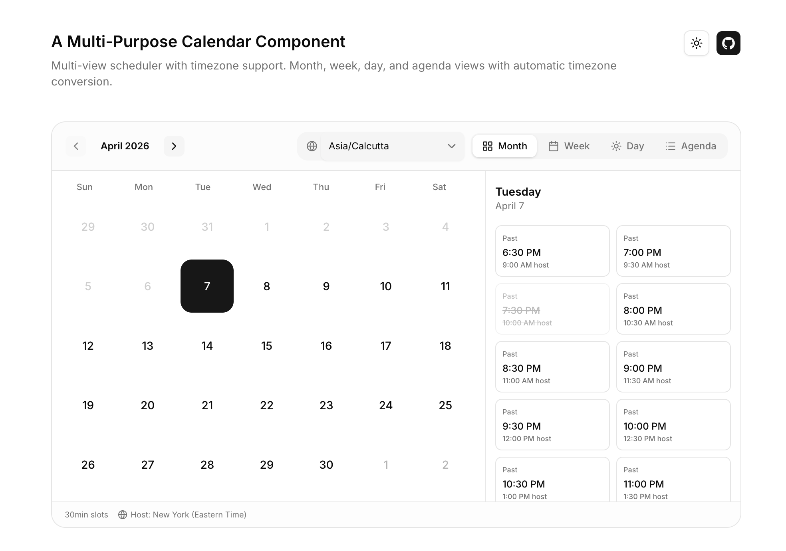

# Calendar Scheduler

A flexible, multi-timezone calendar scheduling component.



## Features

- **Multiple Views**: Month, Week, Day, and Agenda views
- **Multi-timezone Support**: Admins set availability in their timezone; viewers see times converted to their local timezone
- **Slot-based Booking**: Configurable slot durations (15, 30, 60 min)
- **Availability Windows**: Define recurring weekly availability
- **Booked Slot Tracking**: Mark slots as unavailable

## Installation

Copy / Download the folder @/calendar and paste in your project!

## Available Components

Located in `src/components/calendar/`:

| Component           | File              | Description                            |
| ------------------- | ----------------- | -------------------------------------- |
| `CalendarScheduler` | `calendar.tsx`    | Main calendar component with all views |
| `MonthView`         | `month-view.tsx`  | Month grid view                        |
| `WeekView`          | `week-view.tsx`   | Week schedule view                     |
| `DayView`           | `day-view.tsx`    | Single day view                        |
| `AgendaView`        | `agenda-view.tsx` | Agenda list view                       |

## Usage

```tsx
import { CalendarScheduler } from "@/components/calendar";

<CalendarScheduler
  availability={[
    { day: "monday", startTime: "09:00", endTime: "17:00", enabled: true },
    { day: "wednesday", startTime: "10:00", endTime: "15:00", enabled: true },
  ]}
  bookedSlots={[{ date: "2024-03-15", time: "10:00" }]}
  slotDuration={30}
  adminTimeZone="America/New_York"
  onDateSelect={(date) => setSelectedDate(date)}
  onSlotSelect={(date, time) => handleBooking(date, time)}
/>;
```

## Props

| Prop                    | Type                                 | Required | Description                    |
| ----------------------- | ------------------------------------ | -------- | ------------------------------ |
| `availability`          | `Availability[]`                     | Yes      | Weekly availability windows    |
| `bookedSlots`           | `BookedSlot[]`                       | No       | Already-booked slots           |
| `slotDuration`          | `number`                             | Yes      | Slot duration in minutes       |
| `adminTimeZone`         | `string`                             | No       | Admin's timezone (IANA format) |
| `defaultViewerTimeZone` | `string`                             | No       | Viewer's timezone              |
| `selectedDate`          | `Date`                               | No       | Initially selected date        |
| `onDateSelect`          | `(date: Date) => void`               | Yes      | Date selection callback        |
| `onSlotSelect`          | `(date: Date, time: string) => void` | Yes      | Slot selection callback        |
